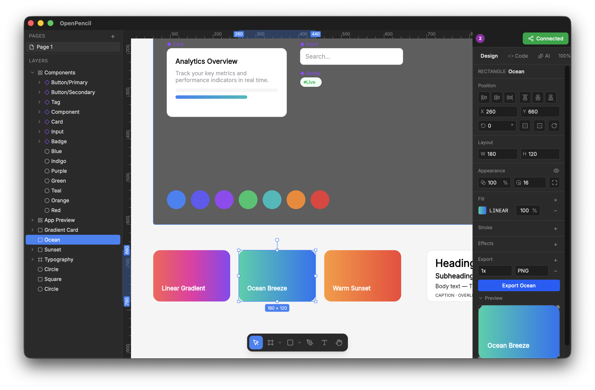

# Lutris.ai

**从想法到可运行代码，一块无限画布。** 开源、AI 原生的产品工作台：澄清 Idea → 生成 Spec → AI 渲染设计 → 一键导出能跑的前端工程。

> **Status:** Active development. Not ready for production use.

**[Try it online →](https://lutris-ai.vercel.app/demo)** · [Open the editor](https://lutris-ai.vercel.app/editor) · [Download](https://github.com/chancelu/lutris.ai/releases/latest)



## 四阶段流水线：AI 辅助，你主导

每一步都有**看得见的推进按钮**——不用等 AI 自觉提交，也不用猜"下一步该干嘛"。

| 阶段 | 做什么 | 用户侧主按钮 |
|------|--------|--------------|
| **💡 Idea** | 和 AI 对话澄清产品想法，自动生成 Idea Brief（定位 / 目标用户 / 核心问题 / 关键决策） | 「总结想法，生成 Spec →」 |
| **📋 Spec** | Spec Studio 全幅需求板：页面、路由、核心组件、交互规则，全部可编辑、有版本历史 | 「确认 Spec，开始设计 →」 |
| **🎨 Design** | AI 按 Spec 把页面渲染成画布上真实的图层——不是截图，每个元素都可选中、可拖拽、可改属性 | 「✓ 完成设计 →」 |
| **🚀 Dev** | 画布即真相地导出代码：Vue SFC / React TSX 即时预览，或下载**可运行的 Vite 工程 zip**（`npm install && npm run dev`） | 「Project」一键打包 |

**没有 API key 也能跑通全程**：欢迎页「从空白画布开始」直接进设计阶段；Dev 阶段「无需 AI，直接导出代码」按钮用本地代码生成器出 Vue/React 双框架。

### 三种起点，条条大路通画布

- **💬 Prompt** — 描述你要什么，AI 生成可编辑的分层 UI
- **📂 .fig 导入** — 拖入 Figma 文件，保留完整图层结构继续迭代
- **📋 PRD 导入** — 粘贴产品文档，AI 提取结构直接进入 Spec 阶段

## Quick start

```sh
git clone https://github.com/chancelu/lutris.ai.git
cd lutris.ai
bun install
bun run dev        # → http://localhost:1420
```

打开编辑器，配一个 [OpenRouter](https://openrouter.ai/keys) key（一个 key 用 100+ 模型；也支持 Anthropic / OpenAI / Google AI 及任意兼容端点）——**或者不配 key，直接从空白画布开始**。

**Local-first**：项目存在浏览器 IndexedDB，数据不出本机；埋点（阶段漏斗 / 按钮点击 / 交付物拿走率）也只写本地，`window.__LUTRIS_ANALYTICS__.events` 可随时自查。

## What else it does

- **真实设计画布** — Skia (CanvasKit WASM) 渲染，Auto layout & CSS Grid（Yoga WASM），Frame / Text / Vector / Component 全可编辑
- **.fig 兼容** — 读写原生 Figma 文件，跨应用复制粘贴节点
- **90+ AI 工具** — 创建/修改节点、设计 token 分析、布尔运算、资源导出
- **实时协作** — WebRTC P2P，无服务器无账号，光标/跟随模式
- **完全可编程** — headless CLI、Figma Plugin API `eval`、MCP server
- **~7 MB 桌面端** — Tauri v2（macOS / Windows / Linux），也可作浏览器 PWA

## CLI

```sh
bun add -g @llc3233149/cli
```

```sh
lutris tree design.fig                            # 浏览节点树
lutris query design.fig "//FRAME[@width < 300]"   # XPath 选择器
lutris export design.fig -f jsx --style tailwind  # 导出 Tailwind JSX
lutris analyze colors design.fig                  # 设计 token 审计
lutris eval design.fig -c "figma.currentPage.children.length" -w
```

桌面端运行时省略文件参数，CLI 通过 RPC 直连活的画布。所有命令支持 `--json`。

## AI & MCP

编辑器内 AI 助手（<kbd>⌘</kbd><kbd>J</kbd>）自带 90 个工具；MCP server 让 Claude Code / Cursor / Windsurf 直连 `.fig` 文件：

```sh
bun add -g @llc3233149/mcp
```

```json
{ "mcpServers": { "lutris": { "command": "lutris-mcp" } } }
```

HTTP 模式：`lutris-mcp-http` → `http://localhost:3100/mcp`。[完整文档 →](https://github.com/chancelu/lutris.ai/tree/main/packages/docs)

## Why

Figma 是封闭平台，且主动对抗程序化访问。它的 MCP 只读；[figma-use](https://github.com/dannote/figma-use) 曾通过 CDP 实现完整读写——随后 [Figma 126 杀掉了 CDP](https://forum.figma.com/report-a-problem-6/remote-debugging-port-not-working-in-figma-desktop-126-1-2-50858)。你的设计文件是只有它的软件才能完整读取的私有二进制格式，你的工作流会因为它的某个小版本更新而断裂。

Lutris.ai 是另一种答案：开源（MIT）、原生读 .fig、每个操作都可脚本化、数据永远不离开你的机器——并且从"我有个想法"一路陪你到"代码能跑起来"。

## Roadmap

- Prototyping — frame transitions, interaction triggers, overlay management, preview mode
- Shader effects (SkSL) — custom visual effects via GPU shaders
- Raster tile caching — instant zoom/pan for complex documents
- Component libraries — publish, share, and consume design systems across files
- CI tools — design linting, code export, visual regression in pipelines
- 埋点远程 sink — 目前是 local-first，跨会话漏斗分析待接上报通道
- Experimental WebGPU/Graphite rendering backend

## Contributing

```sh
bun install
bun run dev        # Dev server at localhost:1420
bun run tauri dev  # Desktop app (requires Rust)
```

| Command | Description |
|---------|-------------|
| `bun run check` | Lint + typecheck |
| `bun run test` | E2E (Playwright) |
| `npx vitest run src/__tests__` | 应用层单测（pipeline / 阶段动作 / 工程包导出 / 埋点） |
| `bun run test:unit` | 引擎单测 |

```
packages/
  core/           @llc3233149/core — engine (scene graph, renderer, layout, codec)
  cli/            @llc3233149/cli — headless CLI
  mcp/            @llc3233149/mcp — MCP server (stdio + HTTP)
  docs/           Documentation site (lutris.ai)
src/              Vue app — pipeline 编排、阶段动作、组件、stores
desktop/          Tauri v2 (Rust + config)
tests/            E2E (happy path / demo / zero-AI 全链路)
```

| Layer | Tech |
|-------|------|
| Rendering | Skia (CanvasKit WASM) |
| Layout | Yoga WASM (flex + grid) |
| UI | Vue 3, Reka UI, Tailwind CSS 4 |
| File format | Kiwi binary + Zstd + ZIP |
| Collaboration | Trystero (WebRTC P2P) + Yjs (CRDT) |
| Desktop | Tauri v2 |
| AI/MCP | Multi-provider (Anthropic, OpenAI, Google AI, OpenRouter), MCP SDK, Hono |

## Acknowledgments

Lutris.ai started as a fork of [Open Pencil](https://github.com/open-pencil/open-pencil) — huge thanks to the original project and its contributors for the foundation this builds on.

## License

MIT
